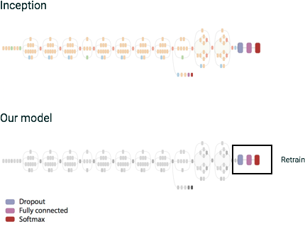

# Classifying your own images using *transfer learning*

The [Google Vision API](xxx) is great for identifying labels, or categories, for a given image. However, sometimes you
want to further classify your own images, in more specialized categories that the Google Vision API hasn't been trained
on.

This lab shows how we can use an existing NN model to do this, via *transfer learning* -- effectively bootstrapping an
existing model to reduce the effort needed to learn something new.

Specifically, we will take an 'Inception' v3 architecture model trained to classify 'ImageNet' images, and using its
penultimate "bottleneck" layer, train a new top layer that can recognize other classes of images -- our own classes.

We'll see that our new top layer does not need to be very complex, and that we don't need to do much training of this
new model, to get good results for our new image classifications.



In addition to the transfer learning, this example shows off several other interesting aspects of TensorFlow and Cloud
ML. It shows how to use
[Cloud Dataflow](https://cloud.google.com/dataflow/) ([Apache Beam](https://beam.apache.org/))
to do image preprocessing -- which uses Inception v3 to generate the inputs to the new 'top layer' that we will train
-- and how to save those preprocessing results in [TFRecords](https://www.tensorflow.org/api_docs/python/python_io/).

The example also includes a little "prediction web server" that shows how you can
**use the Cloud ML API for prediction** once your trained model is serving.

(This example is based on the example
[here](https://github.com/GoogleCloudPlatform/cloudml-samples/tree/master/flowers), but with a number of additional modifications).

## The "hugs" image classification task

[** ... **]

[** ... also 'flower' alternatives... **]

### 1. Image Preprocessing

We start with a set of labeled images in a Google Cloud Storage bucket and preprocess them to extract the image
features from the "bottleneck" layer (typically the penultimate layer) of the Inception network. To do this, we load
the saved Inception model and its variable values into TensorFlow, and run each image through that model.

More specifically, we process each image to produce its feature representation (also known as an *embedding*) in the
form of a k-dimensional vector of floats (in our case, 2,048 dimensions). The preprocessing includes converting the
image format, resizing images, and running the converted image through a pre-trained model to get the embeddings.

The reason this is so effective for bootstrapping new image classification is that these 'bottleneck' embeddings
contain a lot of high-level feature information useful to Inception for its own image classification.

Although processing images in this manner can be reasonably expensive, each image can be processed independently and in
parallel, making this task a great candidate for Cloud Dataflow.

#### 1.1 Deploy the preprocessing job to Cloud Dataflow

We need to run preprocessing for both our training and evaluation images.  We've defined a script, `hugs_preproc.sh`,
to do this.

First, set the `BUCKET` variable to point to your GCS bucket (replacing `your-bucket-name` with the actual name):

```shell
BUCKET=gs://your-bucket-name
```

Then, run the pre-processing script.  By default, it will launch two non-blocking Cloud Dataflow jobs to do the preprocessing for the eval and training datasets. By default it only uses 3 workers for each job, but you can change this if you have larger quota.

```shell
./hugs_preproc.sh $BUCKET
```

If running in a docker container, instead run the script as follows, defining the `USER` environment var:

```shell
USER=xxx ./hugs_preproc.sh $BUCKET
```

This script will generate a `GCS_PATH` (that it will display in STDOUT).
The pipelines will write the generated embeds, in the form of TFRecord protobuf files, to under `$GCS_PATH/preproc`.

You can see your pipeline jobs running in the Dataflow panel of the [Cloud console](https://console.cloud.google.com/dataflow).
Before you use these generated embeds, you'll want to make sure that the Dataflow jobs have finished.


### 2. Modeling: Training the classifier

Once we've preprocessed our data, we can then train a simple classifier. The network will comprise a single fully-
connected layer with *RELU* activations and with one output for each label in the dictionary to replace the original
output layer.
The final output is computed using the [softmax](https://en.wikipedia.org/wiki/Softmax_function) function. In the
training stages, we're using the [*dropout*](https://en.wikipedia.org/wiki/Dropout_(neural_networks)) technique, which
randomly ignores a subset of input weights to prevent over-fitting to the training dataset.

### 2.1 For the workshop, use pre-generated TFRecords for training

Because we have limited workshop time, we've saved a set of generated TFRecords for the "hugs" images that you can
copy to your own bucket, so that you don't need to wait for Dataflow jobs to finish. If you didn't already copy this
data as part of the [installation instructions](xxx), you can do it now.

Copy a zip of the generated records to a directory on your local machine:

```shell
gsutil cp gs://oscon-tf-workshop-materials/transfer_learning/cloudml/hugs_preproc_tfrecords.zip .
```

and then expand the zip:

```shell
unzip hugs_preproc_tfrecords.zip
```

Set the `GCS_PATH` variable to point to a new directory under your own bucket, and copy the unzipped records to a `preproc` directory under that path:

```shell
GCS_PATH=$BUCKET/hugs_preproc_tfrecords
gsutil cp -r hugs_preproc_tfrecords/ $GCS_PATH/preproc
```

Once you've done that you can delete the local zip and `hugs_preproc_tfrecords` directory.

(As indicated above, if we had a bit more time in this workshop, you could wait for your Dataflow preprocessing jobs to finish running, then point to your own generated image embeds instead).

### 2.2 Run the training script

Now, using the value of `GCS_PATH` that you set above, run your training job in the cloud:

```
./hugs_train.sh $BUCKET $GCS_PATH
```

This script .... results under ....${GCS_PATH}/preproc/train

### 2.3 Monitor the training

You should see... if not, ...

```
gcloud beta ml jobs stream-logs "$JOB_ID"
```

We can also monitor progress of the training using tensorboard. [** ... add image... **]

### Distributed training

[** alternately..... `config.yaml`... cluster takes a bit more time to spin up, but then is fast...**]

### 3. Prediction: Using the trained model

For prediction, we don't want to separate the image preprocessing and inference into two separate steps because we need to perform both in sequence for every image. Instead, we create a single TensorFlow graph that produces the image embedding and does the classification using the trained model in one step.

After training, the saved model information will be in `$GCS_PATH/training/model`.

(E.g., if you used the pregenerated records, it will be here:
$BUCKET/hugs_preproc_tfrecords/training/model)

Our next step is to tell Cloud ML that we want to use and serve that model.

./model.sh $GCS_PATH v1 hugs


```shell
gcloud beta ml models list
```

```shell
gcloud beta ml models create hugs
```

#### 3.1 Run the prediction web server

[** ... **]

## Appendix: Running training locally

If you want to run the training session locally (this can be useful for debugging), you will need to point the
`GOOGLE_APPLICATION_CREDENTIALS` environment variable to a local service account credentials file like this:

```shell
export GOOGLE_APPLICATION_CREDENTIALS=/path/to/credentials/file.json
```

Then initiate the local training like this, defining a local output path to use:

```shell
gcloud beta ml local train --package-path trainer/ --module-name trainer.task \
    -- \
    --max-steps 1000 \
    --train_data_paths "$GCS_PATH/preproc/train*" \
    --eval_data_paths "$GCS_PATH/preproc/eval*" \
    --eval_set_size 19 \
    --output_path output/
```


